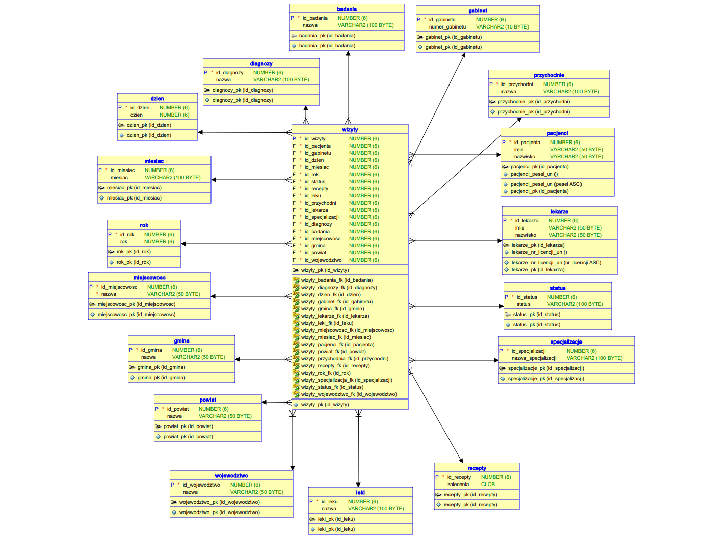

# Clinic-Network-Data-Warehouse-Example

System zaprojektowany do efektywnego przechowywania oraz elastycznego analizowania dużych zbiorów danych medycznych (100 000 rekordów). Projekt demonstruje przewagę wydajnościową architektury OLAP (Hurtownia Danych) nad tradycyjnym modelem OLTP (Relacyjna Baza Danych) w kontekście złożonych zapytań analitycznych. 

Projekt ten został napisany dla **Zaawansowane Techniki Bazodanowe** na **Politechnice Świętokrzyskiej**.

**Model hurtowni danych:** Zastosowano schemat gwiazdy z centralną tabelą faktów `wizyty`. 
**Technologia:** Projekt zrealizowano w środowisku Oracle z wykorzystaniem języka PL/SQL oraz narzędzia SQL\*Loader. 
**Analityka:** Wykorzystanie zaawansowanych funkcji takich jak ROLLUP, CUBE, partycjonowanie obliczeniowe, funkcje rankingowe oraz okna czasowe.

## 1. Architektura Systemu

### Schematy i Modele Danych

| Typ Modelu                | Opis i Wizualizacja                                                                                                                                                                                                                                                                              |
| :------------------------ | :----------------------------------------------------------------------------------------------------------------------------------------------------------------------------------------------------------------------------------------------------------------------------------------------- |
| **Relacyjna Baza Danych** | Model znormalizowany (3NF) obejmujący hierarchię administracyjną (województwo -> powiat -> gmina -> miejscowość) oraz relacje asocjacyjne (lekarze_przychodnie).                                                             |
| **Hurtownia Danych**      | Model gwiazdy z tabelą faktów `wizyty` połączoną z wymiarami: pacjenci, lekarze, przychodnie, gabinet, data, diagnozy, badania, leki. Zastosowano denormalizację wymiarów lokalizacyjnych bezpośrednio do tabeli faktów.     |

## 2. Proces ETL i Ładowanie Danych

Dane zostały wygenerowane z zachowaniem spójności logicznej i zapisane w formatach CSV.

**Narzędzie:** SQL\*Loader. 
**Mechanizm:** Wykorzystanie plików sterujących (CTL) definiujących strukturę i mapowanie danych. 
**Kolejność ładowania:** Najpierw tabele słownikowe (województwo, powiat, leki), następnie tabele zależne (pacjenci, lekarze), a na końcu tabela faktów (wizyty).

## 3. Porównanie Wydajności (OLTP vs OLAP)

Analiza objęła 15 różnych scenariuszy zapytań. Poniżej wybrane wyniki czasowe (w sekundach):

| L.p. | Nazwa zapytania / Funkcja               | Baza Relacyjna | Hurtownia Danych |
| :--- | :-------------------------------------- | :------------: | :--------------: |
| 1    | ROLLUP (Lek/Lekarz/Województwo)         |    9,343 s     |     8,232 s      |
| 5    | CUBE (Badanie/Specjalizacja/Powiat)     |    46,501 s    |     45,737 s     |
| 6    | CUBE (Diagnoza/Specjalizacja/Gmina)     |    54,901 s    |     53,718 s     |
| 7    | Partycje Obliczeniowe (Wizyty pacjenta) |    15,518 s    |     15,031 s     |
| 12   | Funkcje Rankingowe (Przychodnie w woj.) |    0,194 s     |     0,111 s      |
| 15   | Okna Czasowe (Recepty 2024-2025)        |    0,158 s     |     0,112 s      |

##  

**Zalety Hurtowni:** Wykonanie zapytań w hurtowni jest szybsze dzięki uproszczeniu struktury i denormalizacji. 
**Wpływ skali:** Przy obecnej skali (100k rekordów) różnice są zauważalne, lecz pełne korzyści (np. indeksy kolumnowe) objawiają się przy znacznie większych wolumenach danych. 
**Przejrzystość:** Model gwiazdy znacznie ułatwia tworzenie złożonych zapytań analitycznych w porównaniu do silnie znormalizowanej bazy relacyjnej.
